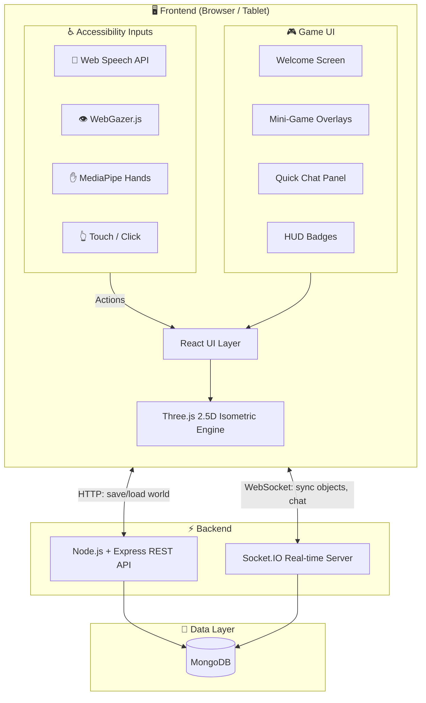
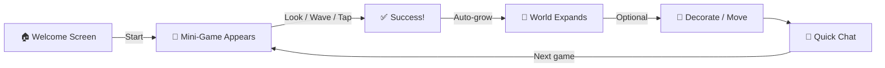

# HackAthena – System Architecture

## System Architecture Diagram



## Tech Stack

| Layer | Technology | Purpose |
|-------|-----------|---------|
| UI Framework | React 18 | Component-based game UI |
| 3D Engine | Three.js | 2.5D isometric world rendering |
| Build Tool | Vite | Fast dev server + bundler |
| Voice | Web Speech API | Voice commands + TTS |
| Eye Tracking | WebGazer.js | Gaze-based selection (dwell) |
| Gestures | MediaPipe Hands | Hand landmark gesture classification |
| Real-time | Socket.IO | Multiplayer sync + chat |
| Backend | Express.js | REST endpoints |
| Database | MongoDB + Mongoose | World state + player data |

## Project Structure

```
hackathena/
├── index.html                    # Entry point with font + WebGazer
├── package.json                  # Frontend deps (react, three, socket.io-client)
├── vite.config.js                # Vite build config
├── ARCHITECTURE.md               # This file
│
├── src/
│   ├── main.jsx                  # React mount
│   ├── App.jsx                   # Game shell (canvas + overlay UI)
│   ├── index.css                 # Design system (pastel palette, animations)
│   │
│   ├── world/
│   │   └── IsometricWorld.js     # Three.js engine (camera, objects, animations)
│   │
│   ├── input/
│   │   └── InputSystem.js        # Voice + Eye + Gesture + TTS
│   │
│   ├── components/
│   │   ├── WelcomeScreen.jsx     # Entry screen with start button
│   │   ├── QuickChat.jsx         # Among Us-style preset messages
│   │   └── MiniGameOverlay.jsx   # Mini-game prompts (Grow, Wake, Catch, Sun)
│   │
│   └── db/
│       └── schema.js             # Mongoose schemas (Player, World, Chat)
│
└── backend/
    ├── package.json              # Backend deps (express, socket.io, mongoose)
    └── server.js                 # Express + Socket.IO multiplayer server
```

## Gameplay Flow


